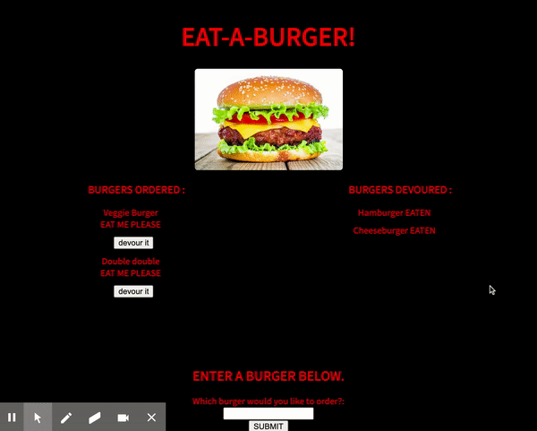
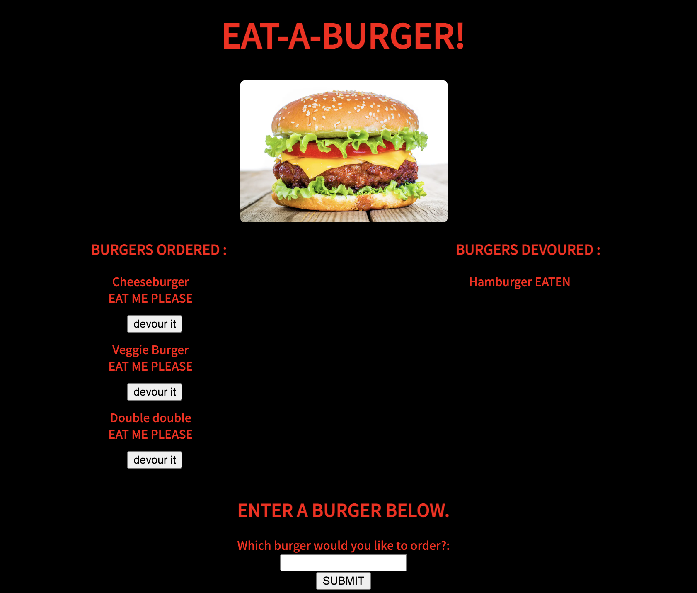

<h1>Eat-A-Burger App</h1>

<h2>Project Details</h2>

This full stack web application uses MySQL, Node, Express, Handlebars and an ORM, to create a burger logger. As the user inputs a new burger, the burger desired populates the page. The user also has an option to click the "devour" button, which upon being clicked, moves the burger to the right side of the page. This app uses the MVC design pattern, Handlebars to produce the HTML while Node and MySQL qeury and route the data from the database.

To start the server, simply open the terminal and run: "nodemon server.js" if you have nodemon installed. Otherwise, use "node server.js"

<h2>GIF/Images</h2>

<h2>Questions</h2>

Github username: lhutchinson22

For a look at my repositories click this link: https://github.com/lhutchinson22

You can reach me at my email address: lbhutchinson022@gmail.com, if you have any questions at all!

